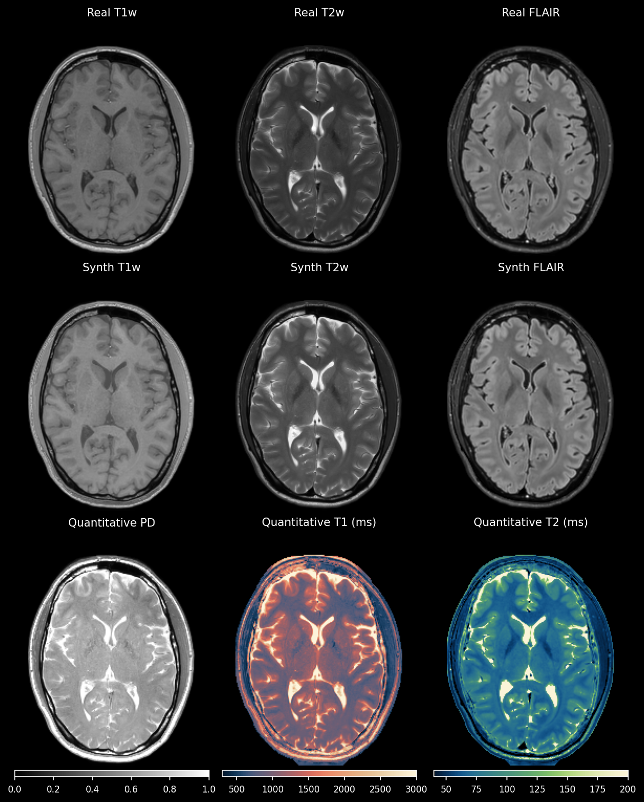

# Self-Supervised Physics-Guided Quantitative Mapping from Conventional MRI

This repository contains the implementation of the paper: **"Quantitative Mapping from Conventional MRI Using Self-Supervised Physics-Guided Deep Learning: Applications to a Large-Scale, Clinically Heterogeneous Dataset"**.

Paper available on arXiv: [2601.05063](https://www.arxiv.org/abs/2601.05063)

## 📋 Abstract
Magnetic resonance imaging (MRI) is a cornerstone of clinical neuroimaging, yet conventional MRIs provide qualitative information heavily dependent on scanner hardware and acquisition settings. While quantitative MRI (qMRI) offers intrinsic tissue parameters, the requirement for specialized acquisition protocols and reconstruction algorithms restricts its availability and impedes large-scale biomarker research.  This study presents a self-supervised physics-guided deep learning framework to infer quantitative T1, T2, and proton-density (PD) maps directly from widely available clinical conventional T1-weighted, T2-weighted, and FLAIR MRIs. The framework was trained and evaluated on a large-scale, clinically heterogeneous dataset comprising 4,121 scan sessions acquired at our instituion over six years on four different $3$~T MRI scanner systems, capturing real-world clinical variability. The framework integrates Bloch-based signal models directly into the training objective. Across more than 600 test sessions, the generated maps exhibited white matter and gray matter values consistent with literature ranges. Additionally, the generated maps showed invariance to scanner hardware and acquisition protocol groups, with inter-group coefficients of variation $\leq$ 1.1\%. Subject-specific analyses demonstrated excellent voxel-wise reproducibility across scanner systems and sequence parameters, with Pearson $r$ and concordance correlation coefficients exceeding 0.82 for T1 and T2. Mean relative voxel-wise differences were low across all quantitative parameters, especially for T2 (< 6\%). These results indicate that the proposed framework can robustly transform diverse clinical conventional MRI data into quantitative maps, potentially paving the way for large-scale quantitative biomarker research. 


## 🛠️ Installation

This project is managed using **[uv](https://github.com/astral-sh/uv)** and  **[Weights & Biases (wandb)](https://wandb.ai/)** is used for experiment tracking.

### Prerequisites

  * Python 3.11+
  * [uv](https://github.com/astral-sh/uv) installed

### Setup

1.  **Clone the repository:**

    ```bash
    git clone https://github.com/JelmervanL/Quantitative-mapping-from-conventional-MRI.git
    cd Quantitative-mapping-from-conventional-MRI
    ```

2.  **Initialize environment and install dependencies:**

    ```bash
    # install dependencies from pyproject.toml with uv
    uv sync
    ```

-----

## 📂 Project Structure

```text
.
├── checkpoints/             # Directory where trained models/weights are saved
├── configs/                 # YAML configuration files for training and testing
│   ├── test_umcu_paper1.yaml
│   └── train_umcu_paper1.yaml
├── example_data/            # Sample data for testing the pipeline 
│   ├── images/              # Folder containing NIfTI images
│   ├── masks/               # Folder containing tissue masks
│   └── test_example.csv     # CSV file defining the dataset and sequence parameters
├── qmap/                    # Main source code package
│   ├── data/
│   │   └── conventional_dataset.py   # Dataset loading logic (TorchIO)
│   ├── models/
│   │   ├── base_model.py
│   │   ├── losses.py                 
│   │   ├── networks.py               # Neural network architectures 
│   │   └── qmap_synth_model.py       # Core physics synthesis model and backward function
│   ├── options/
│   │   ├── base_options.py
│   │   ├── test_options.py
│   │   └── train_options.py
│   └── util/
│       ├── lipari.csv                # colormaps for quantitative map plotting
│       ├── navia.csv                 # colormaps for quantitative map plotting
│       └── util.py                   # Helper functions
├── .gitignore
├── .python-version
├── pyproject.toml           # Project configuration and dependencies
├── README.md
├── test.py                  # Main entry point for inference
├── train.py                 # Main entry point for training
└── uv.lock                  # UV lockfile for reproducible environments
```

-----

## 🏃 Usage

### 1\. Data Preparation

#### MRI Preprocessing

The model expects preprocessed NIfTI files. Per the paper's methodology:

1.  **Convert** DICOM to NIfTI (e.g., using `dcm2niix`).
2.  **Register** T1w and FLAIR to the T2w space (rigid registration).
3.  **Resample** to $1 \times 1 \text{ mm}^2$ in-plane resolution.
4.  **Bias Correction** N4 bias field correction.

#### CSV Configuration

To run the code, you must provide a CSV file (like `example_data/test_example.csv`) containing the specific sequence parameters for each subject for each contrast. These parameters are required for the Bloch equation signal modeling. A seperate csv is required for train/val/test.

Required CSV Columns:

  * **Subject ID / Paths:** `subject_id`, 
  * **Sequence Parameters:**
      * **T1w:** `T1w_TR` (Repetition Time), `T1w_TE` (Echo Time), `T1w_FA` (Flip Angle).
      * **T2w:** `T2w_TR`, `T2w_TE`, `T2w_FA` 
      * **FLAIR:** `FLAIR_TR`, `FLAIR_TE`, `FLAIR_TI`, `FLAIR_FA`.
  * **Reference global rescaling factor** : `T1w_rescale`, `T2w_rescale`, `FLAIR_rescale` (see the paper for details)
     
#### File Structure Input Data
```text
data_root/
├── images/
│   ├── example_001_FLAIR.nii.gz
│   ├── example_001_T1w.nii.gz
│   └── example_001_T2w.nii.gz
├── masks/
│   ├── example_001_brain.nii.gz  # Required for training/evaluation
│   ├── example_001_csf.nii.gz
│   ├── example_001_gm.nii.gz
│   └── example_001_wm.nii.gz
├── train_example.csv                  
├── val_example.csv                  
└── test_example.csv                        
```

### 2\. Training

> **Note:** We cannot make the original clinical training dataset public due to privacy regulations. However, you can train the model on your own dataset using the command below.

To train the model:

1. **Adjust configs to point to your data.**

2. **Run:**
<!-- end list -->

```bash
uv run train.py --config configs/your_config.yaml
```

### 3\. Inference / Testing

We provide a pre-processed example of a healthy volunteer in the `example_data/` folder to verify the installation.

1.  **Download Weights:** Download the pre-trained model weights from the **Releases** page.
2.  **Place Weights:** Move the downloaded model file into the following directory:
    `checkpoints/trained_model/qstar_model_PD0p1_TV0p01_lq20`
3.  **Run Inference:**

<!-- end list -->

```bash
uv run test.py --config configs/test.yaml
```

The results (Quantitative Maps and metrics) will be saved in the specified directory in the `checkpoints` folder (`results/test_T1wT2wFLAIR_example/` in this case).

**Example Output:**
<p align="center">
  
  <br>
  <i>Figure 1: Representative axial slice of generated quantitative T1, T2, and PD maps from conventional MRIs.</i>
</p>

-----


## 📄 License

This project is licensed under a **Creative Commons Attribution-NonCommercial (CC BY-NC)** license.
